# 任务及上下文

## 任务

任务就是进程或者线程，协程，就是一个执行流；

- 程序入口地址
- 堆栈 - 内核栈
- 寄存器信息

## ABI 调用约定

Application Binary Interface

System V ABI

调用方保存：

- eax
- ecx
- edx

实现方保存，调用完成后寄存器值不变：

- ebx
- esi
- edi
- ebp
- esp

## 内存分页

4G / 4K = 1M

## 任务内存分布




##任务切换：
```s
global task_switch
task_switch:
    push ebp
    mov ebp, esp

    push ebx
    push esi
    push edi

    mov eax, esp;
    and eax, 0xfffff000 ;current

    mov [eax], esp      ;保存当前进程的esp

    mov eax, [ebp + 8]  ;next
    mov esp, [eax]      ;恢复到next进程的esp

    pop edi
    pop esi
    pop ebx
    pop ebp         ;从next进程的栈中恢复栈帧，恢复到next进程

    ret
```


## 参考文献

- <https://en.wikipedia.org/wiki/Application_binary_interface>
- <https://stackoverflow.com/questions/2171177/what-is-an-application-binary-interface-abi>
- <https://wiki.osdev.org/System_V_ABI>
